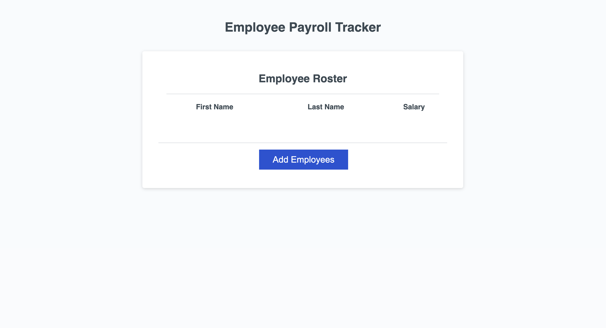

# Employee Payroll Tracker

## Description
This project is meant for a hypothetical payroll manager to be able to
keep track of their employee's payroll data so the manager can budget for
their company accordingly. When typing the first name, last name and salary
of the employee(s), the manager will be displayed with all the info needed,
as well as the salary average and the random employee winner( logged to the
console ).

## Built with
- HTML
- CSS
- JavaScript

## Links

## Screenshot
